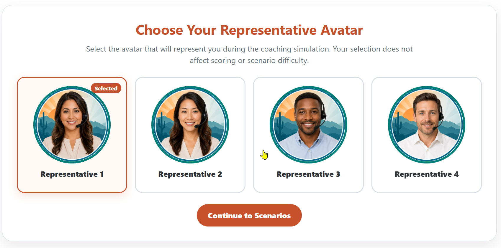

# Call Center Coaching Simulator

[Launch the live simulator](https://skipuros.github.io/call_center_coaching_simulator/)

An interactive learning simulation that helps call center employees practice decisions that balance service quality with call accuracy.

This is a generic portfolio demonstration. It contains no employer, customer, or proprietary information.



## Learning Purpose

The simulator places learners in four realistic calls. Each decision changes two performance measures and produces immediate coaching feedback.

The experience demonstrates how scenario based practice can connect communication choices to observable performance standards.

## Features

* Four realistic coaching scenarios
* Three response choices per scenario
* Immediate feedback for every decision
* Service Quality and Call Accuracy scoring
* Final performance summary
* Restart option for repeated practice
* Responsive layout for desktop and mobile devices
* Keyboard accessible controls and visible focus states
* Reduced motion support

## Technology

* React
* TypeScript
* HTML
* CSS
* Next.js

## Instructional Design Approach

The simulator uses consequence based feedback. Strong decisions model empathy, ownership, accurate processes, and clear next steps. Less effective decisions receive specific coaching that explains how the response could affect the caller or the accuracy of the call.

The scoring model begins each learner at 60 for both measures. Each decision adds or subtracts points based on its effect on service and accuracy.

## Accessibility

* Semantic headings, landmarks, labels, and fieldsets
* Native radio buttons and buttons
* Keyboard navigation
* Visible focus indicators
* Text labels for scores and feedback
* Color is not the only indicator of meaning
* Reduced motion support

## Run Locally

Install Node.js 22 or later, then run:

```bash
npm install
npm run dev
```

## Author

Steve Kipuros

[Portfolio](https://kipuros.com) | [LinkedIn](https://www.linkedin.com/in/steve-kipuros)
